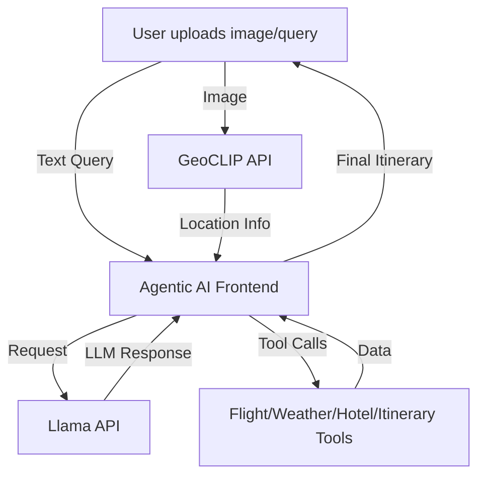
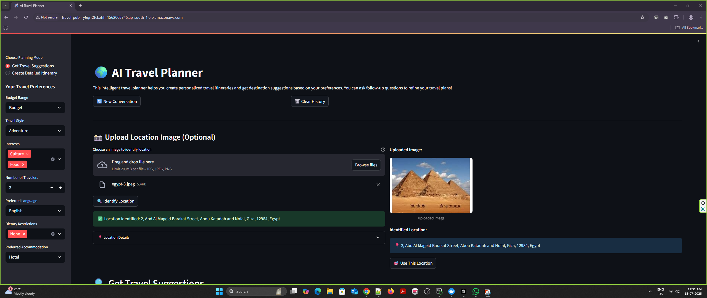
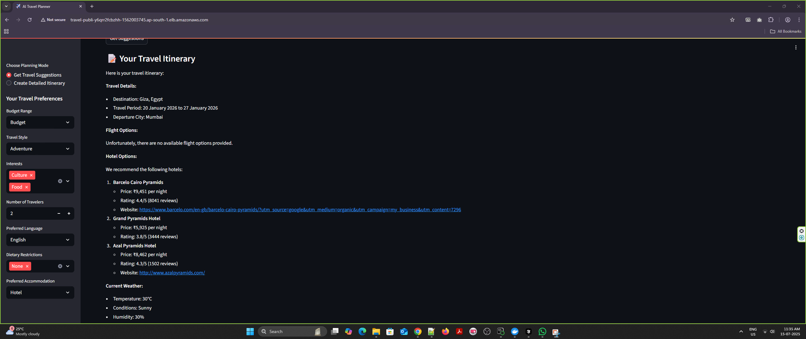

# VoyagerTripPlanner: Agentic AI Travel Assistant

**A modular, interactive AI travel planner that leverages agent-based reasoning, geolocation analysis, and advanced LLM-powered itinerary design.**


## 📌 Overview

VoyagerTripPlanner is a next-generation travel planning suite that turns your ideas, prompts, or even travel photos into a detailed, multi-day itinerary. By orchestrating LLMs, image-based location inference, and multi-tool agents, it provides a seamless, end-to-end trip planning workflow—from destination recognition to custom activity recommendations and logistics.


## 🧩 Major Modules

### 1️⃣ `geoclip_api/` – Image-Based Geolocation API
- Accepts a user-uploaded photo, predicts the likely geographic location, and returns confidence scores and metadata.
- Includes REST endpoints, reverse geocoding, and logs for transparency.

### 2️⃣ `llama_fine_tuning/` – Domain-Tuned Llama Serving
- Fine-tuned Llama-3 for specialized travel dialog (e.g., India-specific suggestions).
- API endpoints for real-time LLM-backed recommendation and conversation.

### 3️⃣ `agentic_ai/` – Multi-Agent Orchestration & Streamlit App
- Full-stack UI (Streamlit) for user interaction.
- Backend agent engine powered by LangChain, integrating:
    - Flight Search
    - Weather Info
    - Hotel Booking
    - Itinerary Generation
- Handles both text and image input, fuses responses from Llama and GeoCLIP.
- Includes fallback to cloud LLM APIs for robustness.

---

## 🛣️ Execution Flow



---

## 📁 Directory Structure

```text
VoyagerTripPlanner/
├── agentic_ai/
│   ├── app.py
│   ├── run_app.py
│   ├── start.py
│   ├── requirements.txt
│   ├── README.md
│   ├── .env.example
│   ├── agents/
│   ├── tools/
│   ├── mcp_server/
│   ├── workflows/
│   ├── logs/
│   └── ...
├── geoclip_api/
│   ├── api.py
│   ├── api-gpu.py
│   ├── README.md
│   ├── requirements.txt
│   ├── .env.example
│   ├── logs/
│   └── ...
├── llama_fine_tuning/
│   ├── llama_api.py
│   ├── requirements.txt
│   ├── README.md
│   ├── logs/
│   └── ...
├── configs/
├── data/
├── scripts/
├── sft/
├── docker-compose.yml
├── requirements.txt
├── README.md  # This file
└── ...
```

---

## 🖼️ Application Screenshots

<div align="center">
  
  <br>
  
</div>

---

## 🚀 Setup & Installation

### 1. Clone the Repository
```bash
git clone <your-repo-url>
cd VoyagerTripPlanner
```

### 2. Install Dependencies
For each module, create a Python environment and install requirements:
- `geoclip_api/requirements.txt`
- `llama_fine_tuning/requirements.txt`
- `agentic_ai/requirements.txt`

### 3. Configure API Keys
Copy `.env.example` to `.env` in each folder and add your LLM/geolocation API credentials.

### 4. Launch the System

**Step 1: Start the Llama API**
```bash
python llama_fine_tuning/llama_api.py
```

**Step 2: Start the GeoCLIP API**
```bash
python geoclip_api/api-gpu.py
```

**Step 3: Start the Agentic AI Application**
```bash
python agentic_ai/start.py
```

The application UI will connect to the APIs and present the interactive planner.

---

## 🐳 Docker Deployment

- Each component includes a Dockerfile.
- Use `docker-compose.yml` for multi-service orchestration and deployment.

---

## 🛠️ Troubleshooting

- Check `.env` files for correct credentials.
- Install all Python dependencies per module.
- Resolve port conflicts as needed.
- Review logs in each module’s `logs/` directory for detailed errors.

---

## 🤝 How to Contribute

1. Fork this repo and create a new feature branch.
2. Add your improvements.
3. Open a pull request and describe your changes.
4. For larger changes, open an issue first for discussion.

---

## 🏅 Acknowledgments

- Inspired by the ERA-V3 Capstone and The School of AI community.
- Built with open-source libraries: HuggingFace, LangChain, Streamlit, and GeoCLIP.

---

<div align="center">
  <b>🌟 VoyagerTripPlanner — Multi-Agent Intelligence for Effortless Travel Planning! 🌟</b>
</div>
